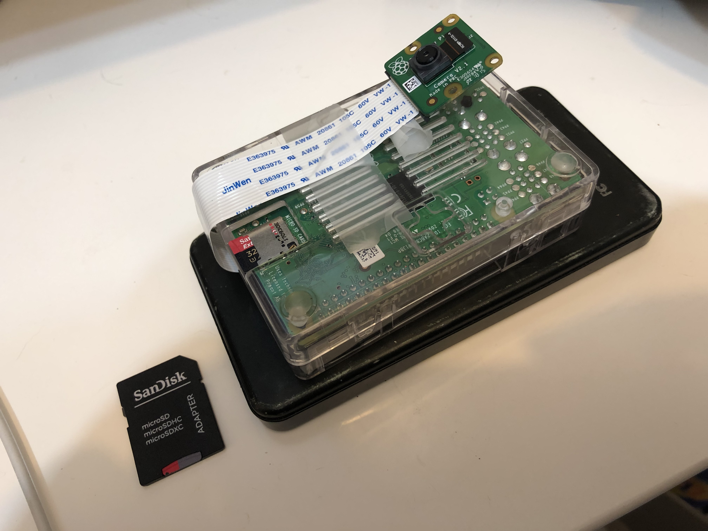
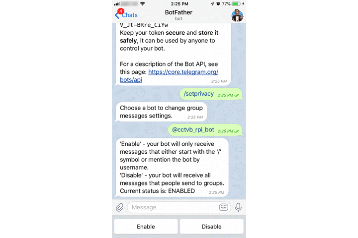
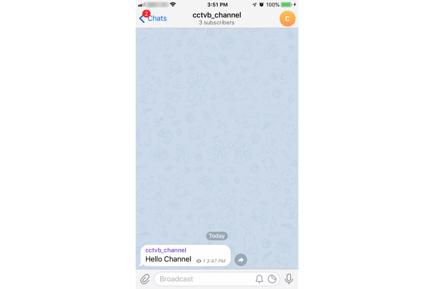
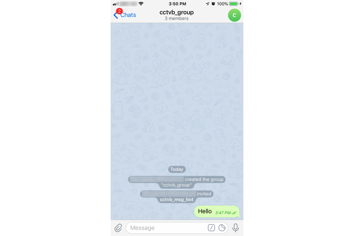
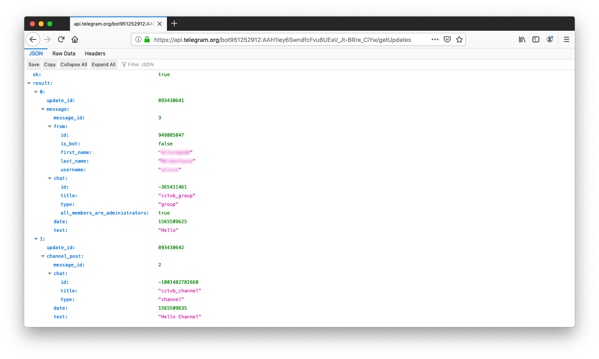
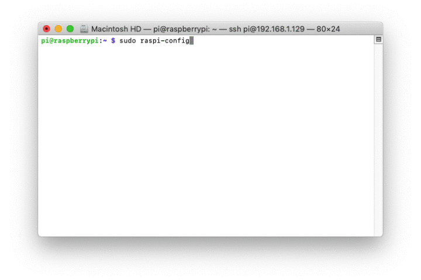
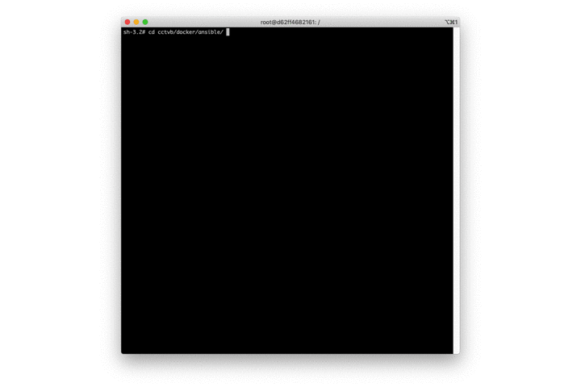
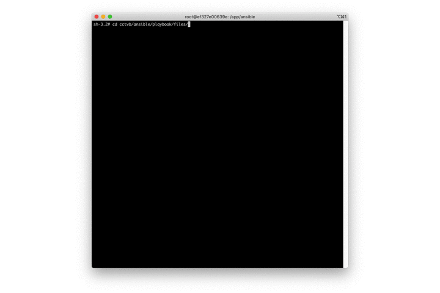
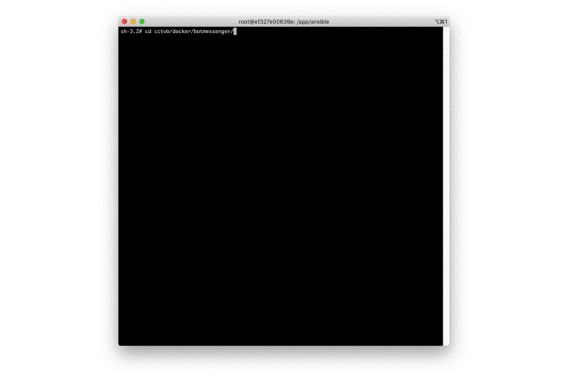
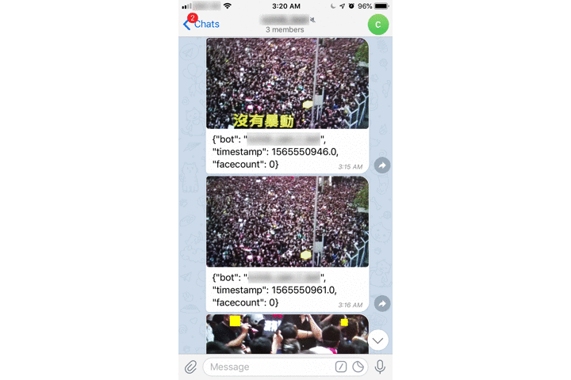

# CCTV Broadcasting (CCTVB)

CCTVB aim to provide a secure and easy to instal CCTV broadcasting system with the use of Raspberry Pi and Telegram. The idea is using a Raspberry Pi to continually take image captures with its camera module, and submit the encrypted images to a private Telegram channel by using a Telegram bot. In the meantime, another Telegram bot that run on your desktop machine (or cloud virtual machine) would decrypt and process the images that sent to the Telegram channel, and post it to another private Telegram group.

The advantages of the systems include:

* Better security when compared to traditional home use CCTV system in the sense that no incoming internet access would be required. The distribution of processed images would be controlled by a machine that owned / controlled by you.
* Highly portable and easy to install as CCTV module itself is even smaller than a portable power bank (as you can see in the picture below). In addition, a portable power bank can power up this CCTV module for hours.
* Higher privacy when compared to other CCTV system as it comes with functionality that remove human faces from the images captured automatically.  The feature would be further elaborated in the last section of this README.

## Table of content

* [Hardware Suggestion] (#hardware-suggestion)
* [Telegram Preparation] (#telegram-preparation)
* [Raspberry Pi Configuration] (#raspberry-pi-configuration)
* [Bot Messenger Configuration] (#bot-messenger-configuration)

## Hardware Suggestion

* Raspberry Pi 3 Model B+
* Raspberry Pi Camera V2
* Power Bank (optional - when power supply is not available)

<p align="center"></p>

## Telegram Preparation

### Create Telegram bots

1. You will need to create 2 Telegram bots.
	* CCTV Raspberry Pi Bot (`cctv_rpi_bot`) - for submitting encrypted images from Raspberry Pi to a Telegram channel
	* CCTV Messenger Bot (`cctv_msg_bot`) - for processing the encrypted images on your desktop machine (or Cloud Virtual Machine)

2. Search for the “botfather” Telegram bot (he is the one that will assist you with creating and managing your bot)

3. Type `/newbot` and follow its instruction to a create a new bot

4. You have created your Telegram bot. You should see a new API token generated for it (for example, you can see my newly generated token is `951252912:AAH1iey6SwndfcFvu6UEaV_Jt-BRre_CiYw`)

5. Type `/setprivacy` and disable it for your bot. This is required to let your bot to retrieve messages in a Telegram group.

	<p align="center"></p>
	
6. Repeat step 2 to 5 to create another Telegram bot. Let assume that the token for the second Telegram bot (`cctv_msg_bot`) is `737696078:AAFvgyagdsWiNT4H8XU3qClm3RW1YrLKw8g`

7. Create a private Telegram channel (`cctvb_channel`) and add both newly created Telegram bot as admin and type a random message in this newly created channel

	<p align="center"></p>

8. Create a private Telegram group (`cctvb_group`) and add both newly created Telegram bot and type a random message in this newly created group

	<p align="center"></p>

9. Obtain the Chat ID of the Telegram channel and Telegram group by entering the URL `https://api.telegram.org/bot{bot token}/getUpdates` in your browser. (for example, you can see my URL is `https://api.telegram.org/bot951252912:AAH1iey6SwndfcFvu6UEaV_Jt-BRre_CiYw/getUpdates`, while the Telegram channel chat id and Telegram group chat id are -1001482782660 and -365411461, respectively)

	<p align="center"></p>

## Raspberry Pi Configuration

1. Instiall `Raspbian Lite` according to instructions in [Raspbery Pi web page](https://www.raspberrypi.org/documentation/installation/installing-images/) 

2. Configure the Raspberry Pi after plug in the SD card, monitor and keyboard into Raspberry Pi

	```
	sudo raspi-config
	select 5 Interfacing Options
	enable P1 camera
	enable P2 SSH
	```

	<p align="center"></p>

3. Install [docker](https://docs.docker.com/install/) on your machine

4. Git clone this repository `git clone https://github.com/ailuropoda-hk/cctvb.git`

5. Generate Public and Private keys (only required for the first time configuration). Please be reminded to safekeep your key pairs, especially the private key, and do not share it with others.

	```
	--- Your Machine ----
	cd cctvb/docker/ansible/
	sh run.sh
	--- Docker Container ----
	cd /app/keypair
	python genkeypair.py
	exit
	```
	
	<p align="center"></p>

6. Create env file in `cctvb/ansible/playbook/files/env.file` (please refer to the sample `env.file.sample`). The `BOT_TOKEN` here would be the token of `cctv_rpi_bot` created above, while the `CHAT_ID` would be the Telegram channel chat id obtained above.

	```
	PUBLIC_KEY_FILENAME=/app/cctvb/public_key.pem
	BOT_TOKEN=951252912:AAH1iey6SwndfcFvu6UEaV_Jt-BRre_CiYw //To replace with your own bot token
	CHAT_ID=-1001482782660 // To replace with your own channel chat id
	IS_CUSTOM_RESOLUTION=False
	RESOLUTION_WIDTH=1920
	RESOLUTION_HIEGH=1080
	CAPTURE_INTERVAL=5
	```


7. Create a Raspberry Pi WiFi configuration file in `cctvb/ansible/playbook/files/wpa_supplicant.conf` (please refer to the sample `wpa_supplicant.conf.sample`). The Raspberry Pi would require internet access in order to submit the encrypted images to the Telegram channel. It would be ideal that the signal of your WiFi router at home could be reached by the Raspberry Pi module.  You can also use a portable 4G mobile WiFi or even a mobile hotspot as an alternative.
	
	```
	ctrl_interface=DIR=/var/run/wpa_supplicant GROUP=netdev
	update_config=1
	country=HK
	     
	network={
	    ssid="FreedomHK"
	    psk="democracynow"
	    scan_ssid=1
	}
	```

8. Deploy this Python program to the Raspberry Pi

	```
	--- Your Machine ----
	cd cctvb/docker/ansible/
	sh run.sh
	--- Docker Container ----
	cd /app/ansible
	ansible-playbook rpicam.yml -e working_host={IP address of the Raspberry Pi}
	exit
	```

	<p align="center"></p>

9. Congratulation!!! Your Raspberry Pi module should start taking images and sending the encrypted images to the Telegram channel.

### Bot Messenger Configuration

1. The purpose of Bot Messenger is to decipher the files from the Telegram channel and post it to another Telegram group after processing. Such that everyone in the Telegram group can view the images taken from the Raspberry Pi module, and it serves as the purpose of broadcasting the CCTV images.

2. Create env file in `cctvb/docker/botmessenger/env.file` (please refer to the sample `env.file.sample`). The `SERVER_BOT_TOKEN ` here would be the token of `cctv_msg_bot` created above. While the `INCOMING_CHAT_ID` and `OUTGOING_CHAT_ID` are the Telegram channel chat id and Telegram group chat id respectively.

	```
	SERVER_BOT_TOKEN=737696078:AAFvgyagdsWiNT4H8XU3qClm3RW1YrLKw8g
	INCOMING_CHAT_ID=-1001482782660
	OUTGOING_CHAT_ID=-365411461
	PRIVATE_KEY_FILENAME=/app/keypair/private_key.pem
	```
	
3. Download the machine learning model for removing human face from the images

	```
	--- Your Machine ----
	cd cctvb/docker/botmessenger/
	sh run.sh
	--- Docker Container ----
	cd /app/botmessenger
	sh model_download.sh
	exit
	```

	<p align="center"></p>
	
4. Run the python program `bot_messenger.py`. This program will keep running and distribute the processed images (with human faces removed) to the Telegram group.  

	```
	--- Your Machine ----
	cd cctvb/docker/botmessenger/
	sh run.sh
	--- Docker Container ----
	cd /app/botmessenger
	python3 botmessenger.py
	exit
	```

	<p align="center"></p>
	
5. Below you can find a demonstration of using the CCTV module on some random video on YouTube.

	<p align="center"></p>


<span style="color:white">Liberate Hong Kong, the revolution of our times</span>